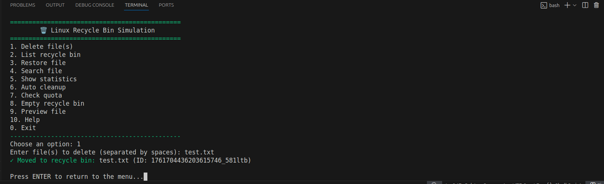
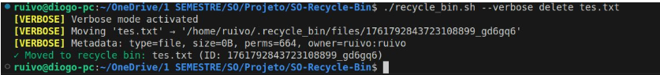
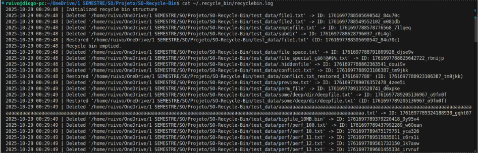
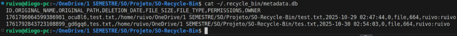
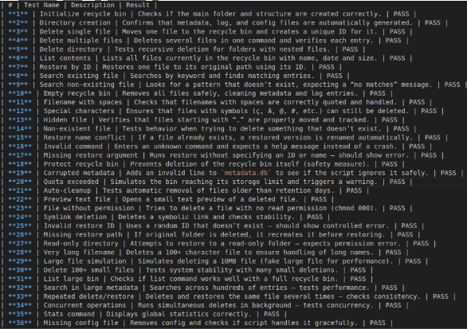
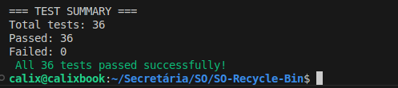
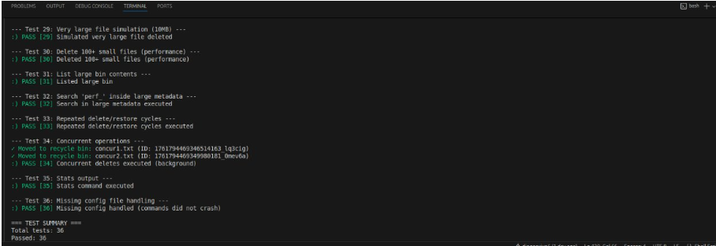

# Linux Recycle Bin — README.md

## Author
David Cálix (125043)
Diogo Ruivo (126498)   
University of Aveiro — Operating Systems (2025/2026)

---

## Overview
This project implements a Linux Recycle Bin system entirely in Bash. Instead of permanently deleting files, the script moves them to a hidden directory (`~/.recycle_bin/`), allowing safe recovery later. The program supports essential operations such as delete, restore, search, list, preview, and empty. It also maintains persistent metadata, logging, configuration management, and automated cleanup based on user-defined retention and quota limits. The goal is to reproduce a full recycle bin experience within the Linux terminal environment, ensuring safety, structure, and clarity of operation.

---

## Installation
To set up the project, follow these steps:
1. Clone or download this repository to your preferred directory.  
2. Make the main script executable:
   ```bash
   chmod +x recycle_bin.sh
3. Initialize the system by running:
    ./recycle_bin.sh help
    This automatically creates the internal structure:
    ~/.recycle_bin/
    ├── files/
    ├── metadata.db
    ├── config
    └── recyclebin.log

After setup, the system is ready to use. All operations can be executed through the terminal using simple commands.

---

## Features
The following functions are implemented within the script:

-initialize_recyclebin()	Creates and validates the internal recycle bin structure.
-delete_file()	Moves selected files to the recycle bin and stores metadata.
-list_recycled()	Displays the list of deleted files with formatted output.
-restore_file()	Restores deleted files to their original directories.
-search_recycled()	Searches by name, extension, or partial pattern.
-empty_recyclebin()	Permanently removes all files in the recycle bin.
-show_statistics()	Displays metrics such as total items, size, and usage.
-auto_cleanup()	Automatically removes old files based on retention days.
-check_quota()	Verifies quota size and triggers cleanup if exceeded.
-preview_file()	Displays the first lines of text-based files.
-display_help()	Shows syntax, available options, and usage examples.
-verbose_echo()	Prints messages only when verbose mode is enabled.
-log_message()	Appends detailed log entries with timestamps.

---

## Configuration
The configuration file is located at ~/.recycle_bin/config and contains:

MAX_SIZE_MB=1024 (sets the maximum allowed recycle bin size in megabytes)
RETENTION_DAYS=30 (defines after how many days old files are automatically deleted)

Both parameters can be modified manually or dynamically by the script

---

## Usage
All functions are accessible through terminal commands. The program accepts parameters defining the desired operation.

Basic Syntax:
./recycle_bin.sh delete <file1> [file2 ...]
./recycle_bin.sh list [--detailed]
./recycle_bin.sh restore <id|filename>
./recycle_bin.sh search <pattern>
./recycle_bin.sh empty [--force]
./recycle_bin.sh help

Example Commands:
./recycle_bin.sh delete document.txt
./recycle_bin.sh list
./recycle_bin.sh restore 1696234567_ab12cd
./recycle_bin.sh search ".pdf"
./recycle_bin.sh empty --force

Filenames with spaces must be enclosed in quotes ("My File.txt"). Restored files with name conflicts are automatically renamed. Root-owned files require administrator privileges. The recycle bin structure is protected and cannot be deleted through the program.

---

## How the Code Works
The system is based on a modular functional design. Each operation is implemented as an independent function within recycle_bin.sh. The script follows the sequence below:

1. The main() function interprets the arguments and dispatches the corresponding function.

2. initialize_recyclebin() ensures that all necessary directories and files exist.

3. delete_file() uses mv and metadata recording to handle safe deletions.

4. list_recycled() and search_recycled() use tools like grep, awk, and cut to process the metadata.db file.

5. restore_file() verifies paths and restores the original structure.

6. log_message() records every event in recyclebin.log.

A typical internal function uses the following logic:

function delete_file() {
    if [ ! -f "$1" ]; then
        echo "Error: File not found."
        return 1
    fi
    id=$(date +%s%N)_$(cat /dev/urandom | tr -dc 'a-z0-9' | head -c 6)
    mv "$1" "$HOME/.recycle_bin/files/$id"
    echo "$id,$(basename "$1"),$(realpath "$1"),$(date +'%Y-%m-%d %H:%M:%S')" >> "$HOME/.recycle_bin/metadata.db"
    echo "File '$1' moved to recycle bin (ID: $id)"
}

This modular design allows easy debugging, testing, and extension of the program without code duplication.

---

## Usage Examples - Examples 
Below are screenshots demonstrating the main functionalities of the Linux Recycle Bin system.

### Delete operation

File successfully moved to recycle bin with unique ID.

### List view (normal mode)

Displays all recycled files in a simple table format.
format
### List view (detailed mode)

Shows extended metadata for each recycled file: ID, size, owner, permissions, and path.

### Restore operation

Restores the selected file to its original location (or creates a renamed copy if it already exists).

### Search results

Search function displaying all `.txt` files currently stored in the recycle bin.

### Main Menu

Interactive text-based interface showing all available options such as delete, restore, search, preview, statistics, and cleanup operations.

### Verbose Mode

Shows detailed real-time messages for each action, including file movement, metadata extraction, and logging — ideal for debugging and transparency.

### Logging System

Every operation is recorded in `recyclebin.log` with timestamps, enabling traceability and error tracking.

### Full Metadata Database

The `metadata.db` file stores full structured information: ID, original name, path, date, size, permissions, and owner for each recycled file.

### Automated Test Suite

36 automated tests covering all functionalities — from basic deletion and restore to stress, concurrency, and error-handling scenarios.


### Performance & Robustness

Demonstrates stability under load: handles hundreds of files, large-size simulations, and special character names without data loss or crashes.

---

## Known Issues

| Problem | Cause | Solution |
|----------|--------|-----------|
| **Permission denied** | The script isn’t executable | Run `chmod +x recycle_bin.sh` |
| **Spaces in filenames cause errors** | Missing quotes around filenames | Always use quotes: `"file name.txt"` |
| **Metadata file corrupted** | Manual edits or interrupted process | Delete `metadata.db`; it will be rebuilt automatically |
| **Restore fails** | The original folder no longer exists | The script recreates missing folders automatically |
| **Recycle bin not found** | Not initialized yet | Run `./recycle_bin.sh help` to auto-create it |
| **Quota warning shown** | Recycle bin reached size limit | Run `./recycle_bin.sh auto_cleanup` to remove old files |
| **Strange characters in names** | Locale or encoding issue | Use `LC_ALL=C` when running the script if needed |
| **Test suite not running** | Missing execution rights | Run `chmod +x test_suite.sh` before executing it |

---

## Limitations

Although the system covers all functional requirements, some limitations remain:

- The recycle bin is local to each user (no multi-user synchronization).  
- The `metadata.db` file is CSV-based, not SQL — suitable for simplicity but limited for large-scale operations.  
- File preview is only available for text-based formats.  
- No graphical interface (CLI only).  
- Quota and retention policies depend on manual configuration.

---

## References
1. GNU Bash Manual — https://www.gnu.org/software/bash/manual/
2. Advanced Bash-Scripting Guide — https://tldp.org/LDP/abs/html/
3. ShellCheck — https://www.shellcheck.net/
4. University of Aveiro — Operating Systems course material (Pedro Azevedo Fernandes)

---

## AI Assistance
ChatGPT (OpenAI) was used exclusively for **debugging support, clarification of Bash concepts**, and verification of technical correctness.  
All code implementation, documentation writing, and testing were entirely developed by the authors without automated content generation.

---

## Project Reflection and Learning Outcomes
This project provided hands-on experience with system scripting and reinforced concepts related to process automation, data management, and file operations in Linux. The authors gained advanced understanding of Bash syntax, error handling, logging, and automated testing.

Main achievements:

1. Mastery of shell programming and parameter handling.
2. Robust design with modular functions and structured logic.
3. Implementation of persistent data storage using CSV-based metadata.
4. Creation of a complete testing suite ensuring code reliability.
5. Production of professional documentation covering technical, testing, and user perspectives.

The Linux Recycle Bin project demonstrates a solid understanding of software structure, testing, and documentation principles, meeting all objectives of the Operating Systems course until now.

---

## Version and License

Version 1.0 — October 2025  
Licensed under the MIT License

---

## End of README.md