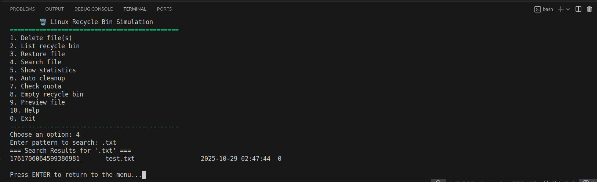

# 🗑️ Linux Recycle Bin — Bash Script

**Authors:** Diogo Ruivo (126498), David Cálix (125043)
---

## Overview

This project implements a simulated **recycle bin system** for Linux using Bash scripting.  
Instead of permanently deleting files, they are moved to a hidden folder (`~/.recycle_bin/`), allowing users to restore them later.

The script mimics the real behavior of a recycle bin:  
you can delete, restore, list, preview, search, or empty files safely — all through the terminal.
---

## Installation Instructions

1. Clone or download this repository.
2. Make the main script executable:
   chmod +x recycle_bin.sh

## Usage Examples - Examples 
Below are screenshots demonstrating the main functionalities of the Linux Recycle Bin system.

### Delete operation
.png)
> File successfully moved to recycle bin with unique ID.

### List view (normal mode)

> Displays all recycled files in a simple table format.

### List view (detailed mode)

> Shows extended metadata for each recycled file: ID, size, owner, permissions, and path.

### Restore operation

> Restores the selected file to its original location (or creates a renamed copy if it already exists).

### Search results

> Search function displaying all `.txt` files currently stored in the recycle bin.

## Troubleshooting Guide

| Problem | Cause | Solution |
|----------|--------|-----------|
| **Permission denied** | The script isn’t executable | Run `chmod +x recycle_bin.sh` |
| **Spaces in filenames cause errors** | Missing quotes around filenames | Always use quotes: `"file name.txt"` |
| **Metadata file corrupted** | Manual edits or interrupted process | Delete `metadata.db`; it will be rebuilt automatically |
| **Restore fails** | The original folder no longer exists | The script recreates missing folders automatically |
| **Recycle bin not found** | Not initialized yet | Run `./recycle_bin.sh help` to auto-create it |
| **Quota warning shown** | Recycle bin reached size limit | Run `./recycle_bin.sh auto_cleanup` to remove old files |
| **Strange characters in names** | Locale or encoding issue | Use `LC_ALL=C` when running the script if needed |
| **Test suite not running** | Missing execution rights | Run `chmod +x test_suite.sh` before executing it |

README.md
🔴 Falta
Ainda não o gerámos (explicações de uso, exemplos e screenshots).

TECHNICAL_DOC.md
🟡 Quase completo
Já criado! Só falta adicionarem os fluxogramas (as brechas estão no documento).

E adiconar comentarios a explicar cada função.