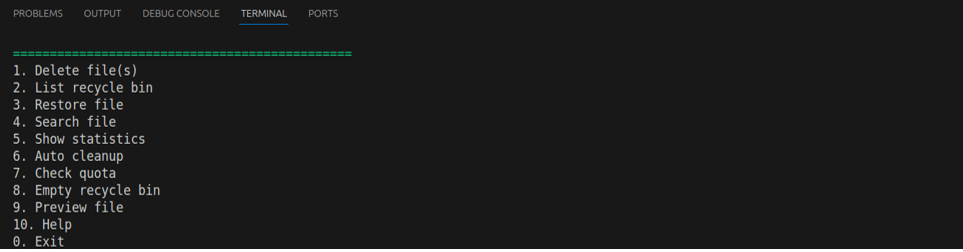

# 🗑️ Linux Recycle Bin — Bash Script

**Authors:** Diogo Ruivo (126498), David Cálix (125043)
---

## Overview

This project implements a simulated **recycle bin system** for Linux using Bash scripting.  
Instead of permanently deleting files, they are moved to a hidden folder (`~/.recycle_bin/`), allowing users to restore them later.

The script mimics the real behavior of a recycle bin:  
you can delete, restore, list, preview, search, or empty files safely — all through the terminal.
---

## Installation Instructions

1. Clone or download this repository.
2. Make the main script executable:
   chmod +x recycle_bin.sh

## Usage Examples - Examples 
Below are screenshots demonstrating the main functionalities of the Linux Recycle Bin system.

### Delete operation
.png)
File successfully moved to recycle bin with unique ID.

### List view (normal mode)

Displays all recycled files in a simple table format.

### List view (detailed mode)

Shows extended metadata for each recycled file: ID, size, owner, permissions, and path.

### Restore operation

Restores the selected file to its original location (or creates a renamed copy if it already exists).

### Search results

Search function displaying all `.txt` files currently stored in the recycle bin.

### Main Menu

Interactive text-based interface showing all available options such as delete, restore, search, preview, statistics, and cleanup operations.

### Verbose Mode

Shows detailed real-time messages for each action, including file movement, metadata extraction, and logging — ideal for debugging and transparency.

### Logging System

Every operation is recorded in `recyclebin.log` with timestamps, enabling traceability and error tracking.

### Full Metadata Database

The `metadata.db` file stores full structured information: ID, original name, path, date, size, permissions, and owner for each recycled file.

### Automated Test Suite

36 automated tests covering all functionalities — from basic deletion and restore to stress, concurrency, and error-handling scenarios.

### Performance & Robustness

Demonstrates stability under load: handles hundreds of files, large-size simulations, and special character names without data loss or crashes.

## Troubleshooting Guide

| Problem | Cause | Solution |
|----------|--------|-----------|
| **Permission denied** | The script isn’t executable | Run `chmod +x recycle_bin.sh` |
| **Spaces in filenames cause errors** | Missing quotes around filenames | Always use quotes: `"file name.txt"` |
| **Metadata file corrupted** | Manual edits or interrupted process | Delete `metadata.db`; it will be rebuilt automatically |
| **Restore fails** | The original folder no longer exists | The script recreates missing folders automatically |
| **Recycle bin not found** | Not initialized yet | Run `./recycle_bin.sh help` to auto-create it |
| **Quota warning shown** | Recycle bin reached size limit | Run `./recycle_bin.sh auto_cleanup` to remove old files |
| **Strange characters in names** | Locale or encoding issue | Use `LC_ALL=C` when running the script if needed |
| **Test suite not running** | Missing execution rights | Run `chmod +x test_suite.sh` before executing it |